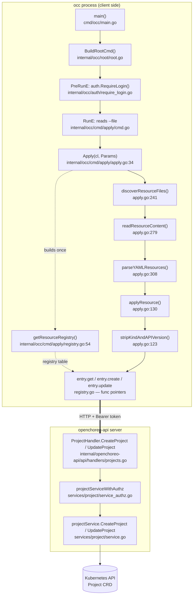
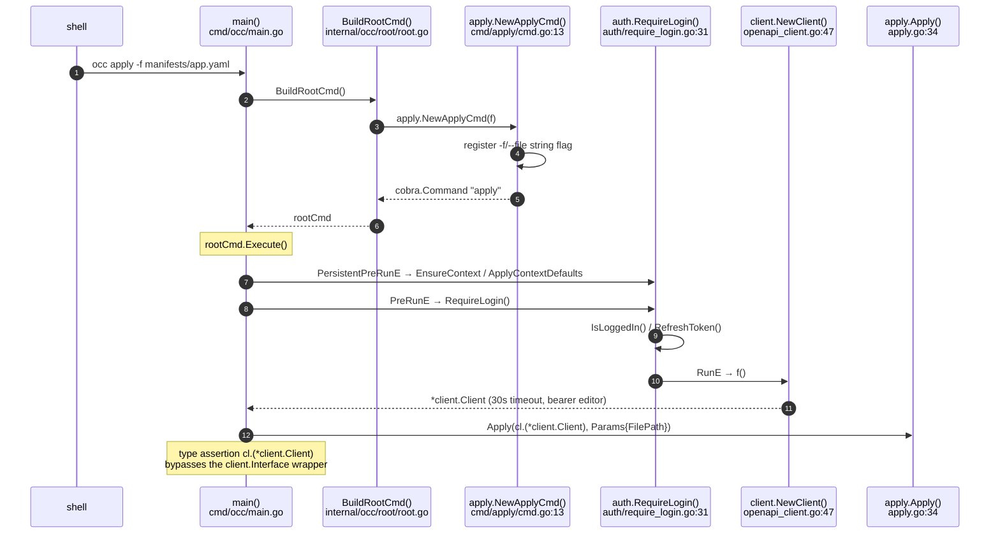
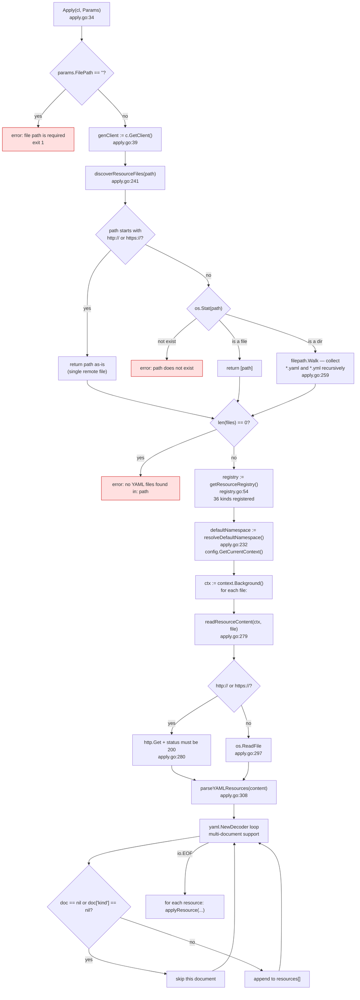
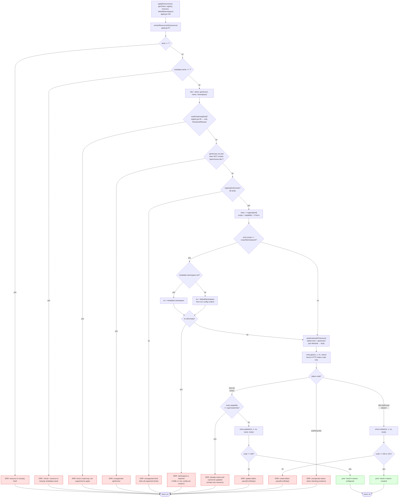
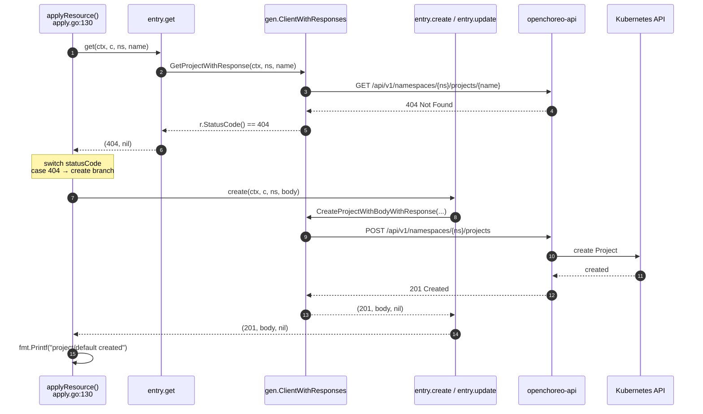
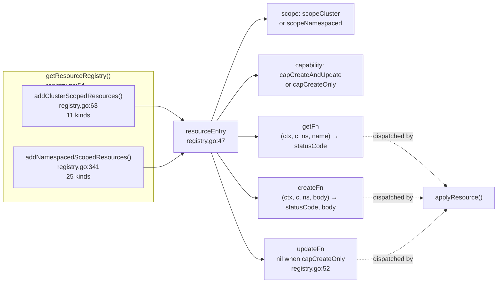
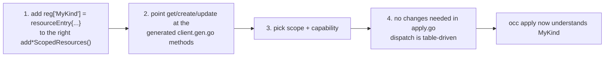
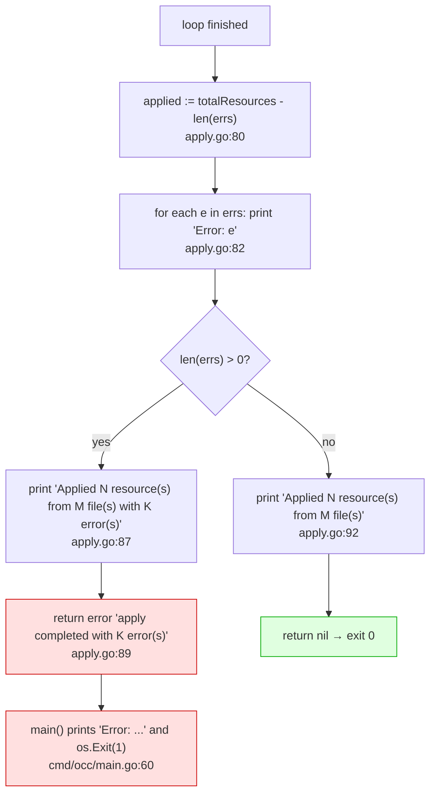
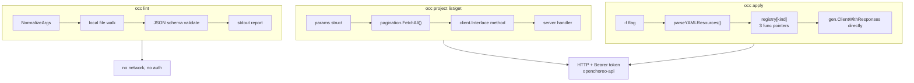

# `occ apply` — End-to-End Call Flow

How `occ apply -f manifest.yaml` turns a YAML file into create/update calls against
the OpenChoreo API. Every box names the **function** and the **file** that runs.

Unlike `occ project list` / `occ project get`, `apply` is **kind-driven**: it reads
`kind` out of your YAML, looks that kind up in a registry table, and dispatches
through function pointers stored in that table. There is no `if kind == "Project"`
chain anywhere in the codebase.

---

## 1. The whole path at a glance



---

## 2. Phase 1 — Command wiring



| Function | File | Role |
|---|---|---|
| `main()` | `cmd/occ/main.go:17` | builds root, installs `PersistentPreRunE` |
| `BuildRootCmd()` | `internal/occ/root/root.go:56` | registers `apply.NewApplyCmd(f)` |
| `apply.NewApplyCmd()` | `internal/occ/cmd/apply/cmd.go:13` | defines `apply`, `-f/--file`, `PreRunE`, `RunE` |
| `auth.RequireLogin()` | `internal/occ/auth/require_login.go:31` | login gate |
| `client.NewClient()` | `internal/occ/resources/client/openapi_client.go:47` | builds the generated client + bearer token |
| `(*Client).GetClient()` | `internal/occ/resources/client/openapi_client.go:92` | unwraps to `*gen.ClientWithResponses` |

Note the one wrinkle in this command: `RunE` does `cl.(*client.Client)` — a
concrete type assertion on the `client.Interface` value. `apply` needs the raw
`*gen.ClientWithResponses` because the registry closures call generated methods
directly, so the interface abstraction is deliberately unwrapped here. This is the
only `occ` subcommand that does this.

---

## 3. Phase 2 — Discover, read, parse



Important behaviours here:

- **`apply` is not recursive-by-design but is recursive-by-necessity.** Given a
  file it processes one file; given a directory it `filepath.Walk`s and collects
  every `.yaml`/`.yml` (apply.go:266-268). There is no `-b` / `-detect` flag the way
  `occ lint vali` has — the directory *is* the flag.
- **Remote URLs are first-class.** A `http://` / `https://` path bypasses
  `os.Stat` entirely and is downloaded with `http.DefaultClient` (apply.go:280).
  The `#nosec G107` annotation is there because this is intentional.
- **Documents without `kind` are skipped silently** (apply.go:320) — a `ConfigMap`
  mixed into a multi-doc YAML file will not be applied and will not be reported.
- **Errors accumulate, they do not abort.** A failed read or parse is appended to
  `errs` and the loop `continue`s to the next file (apply.go:62, 68).

---

## 4. Phase 3 — `applyResource`: the decision ladder

This is the heart of the command. `applyResource()` runs seven guard clauses in
order, then does a get → create-or-update.



### The get → create-or-update trick

`apply` has no `GET`-then-diff. It asks the existence question by making the `GET`
call and reading only its **status code**, discarding the body:



The registry's `getFn` deliberately returns `(int, error)` rather than the decoded
object — see `registry.go:37`. The `get` closures call `r.StatusCode()` and throw
the body away, because `apply` only needs create-vs-update.

---

## 5. Phase 4 — The registry table

`registry.go` is the extension point. It is a `map[string]resourceEntry` where
each entry holds three function pointers, so `applyResource` never switches on kind.



### Cluster-scoped kinds (11) — `registry.go:63-340`

`Namespace`, `ClusterComponentType`, `ClusterTrait`, `ClusterWorkflowPlane`,
`ClusterWorkflow`, `ClusterDataPlane`, `ClusterObservabilityPlane`,
`ClusterAuthzRole`, `ClusterAuthzRoleBinding`, `ClusterResourceType`,
`ClusterProjectType`

All three of scope, capability, and the `ns` argument are ignored for these; the
closures take `_` for the namespace parameter.

### Namespaced kinds (25) — `registry.go:341-946`

`Project`, `Component`, `ComponentType`, `Environment`, `DataPlane`,
`WorkflowPlane`, `ObservabilityPlane`, `DeploymentPipeline`, `Trait`,
`SecretReference`, `Workflow`, `Workload`, `ComponentRelease`, `ReleaseBinding`,
`ObservabilityAlertsNotificationChannel`, `AuthzRole`, `AuthzRoleBinding`,
`ResourceType`, `ProjectType`, `Resource`, `ResourceReleaseBinding`,
`ProjectReleaseBinding`, `WorkflowRun`, `ResourceRelease`, `ProjectRelease`

### Create-only kinds (4)

`ComponentRelease` (registry.go:642), `WorkflowRun` (registry.go:888),
`ResourceRelease` (registry.go:907), `ProjectRelease` (registry.go:926)

These declare `capability: capCreateOnly` and have **no `update` closure at all**
(`update` is nil, registry.go:52). Applying one twice gives you
`projectrelease/default-6d675ddbf6: resource already exists and cannot be updated
(create-only resource)` — the `capCreateOnly` check at apply.go:184 fires before the
nil dereference could happen.

### Read-only kinds (1)

`RenderedRelease` (registry.go:35). It is a real CRD with no Create/Update
endpoints, so `apply` rejects it up front at apply.go:143 — before the registry
lookup, because it is not in the registry at all.

### Adding a new kind



No edit to `applyResource()`, `Apply()`, or `cmd.go` is required.

---

## 6. Output and exit behaviour



Two consequences worth knowing:

- **Partial success is the norm on failure.** `apply` applies everything it can,
  then reports the errors at the end. Exit code 1 does *not* mean nothing was
  applied.
- **`applied` is computed as `totalResources - len(errs)`** (apply.go:80), and
  `errs` holds one entry per failed resource. This arithmetic is correct only
  because every append site corresponds to exactly one resource — worth keeping in
  mind if you add a code path that can append twice.

Example output:

```
namespace/default created
project/default created
deploymentpipeline/default configured

Applied 3 resource(s) from 1 file(s)
```

---

## 7. Full call table

| # | Function | File | Role |
|---|---|---|---|
| 1 | `main()` | `cmd/occ/main.go:17` | builds root, installs `PersistentPreRunE`, maps error → exit 1 |
| 2 | `BuildRootCmd()` | `internal/occ/root/root.go:56` | wires `apply.NewApplyCmd(f)` |
| 3 | `apply.NewApplyCmd()` | `internal/occ/cmd/apply/cmd.go:13` | `apply` command, `-f/--file`, `PreRunE`, `RunE` |
| 4 | `auth.RequireLogin()` | `internal/occ/auth/require_login.go:31` | `PreRunE` login gate |
| 5 | `client.NewClient()` | `internal/occ/resources/client/openapi_client.go:47` | generated client + bearer token, 30s timeout |
| 6 | `(*Client).GetClient()` | `internal/occ/resources/client/openapi_client.go:92` | unwrap to `*gen.ClientWithResponses` |
| 7 | `Apply()` | `internal/occ/cmd/apply/apply.go:34` | top-level orchestration, error accumulation |
| 8 | `discoverResourceFiles()` | `internal/occ/cmd/apply/apply.go:241` | file / dir / URL resolution |
| 9 | `readResourceContent()` | `internal/occ/cmd/apply/apply.go:279` | `os.ReadFile` or HTTP GET |
| 10 | `parseYAMLResources()` | `internal/occ/cmd/apply/apply.go:308` | multi-document YAML → `[]map[string]interface{}` |
| 11 | `resolveDefaultNamespace()` | `internal/occ/cmd/apply/apply.go:232` | namespace from `occ config` context |
| 12 | `config.GetCurrentContext()` | `internal/occ/cmd/config/config.go:586` | reads `~/.openchoreo/config` |
| 13 | `getResourceRegistry()` | `internal/occ/cmd/apply/registry.go:54` | builds the 36-kind table |
| 14 | `addClusterScopedResources()` | `internal/occ/cmd/apply/registry.go:63` | 11 cluster-scoped kinds |
| 15 | `addNamespacedScopedResources()` | `internal/occ/cmd/apply/registry.go:341` | 25 namespaced kinds |
| 16 | `supportedKinds()` | `internal/occ/cmd/apply/registry.go:947` | sorted kind list for the error message |
| 17 | `applyResource()` | `internal/occ/cmd/apply/apply.go:130` | guard ladder + get/create/update |
| 18 | `extractResourceInfo()` | `internal/occ/cmd/apply/apply.go:97` | pulls kind/apiVersion/name/namespace |
| 19 | `stripKindAndAPIVersion()` | `internal/occ/cmd/apply/apply.go:123` | deletes both keys, marshals to JSON |
| 20 | `parseErrorBody()` | `internal/occ/cmd/apply/apply.go:215` | `gen.ErrorResponse` → message, 200-char fallback |
| 21 | `resourceEntry` | `internal/occ/cmd/apply/registry.go:47` | scope + capability + 3 function pointers |
| 22 | `readOnlyKinds` | `internal/occ/cmd/apply/registry.go:35` | `RenderedRelease` rejection set |
| 23 | `(*Handler).CreateProject()` | `internal/openchoreo-api/api/handlers/projects.go:49` | server create handler |
| 24 | `(*Handler).UpdateProject()` | `internal/openchoreo-api/api/handlers/projects.go:124` | server update handler |
| 25 | `projectServiceWithAuthz` | `internal/openchoreo-api/services/project/service_authz.go` | `ActionCreateProject` / `ActionUpdateProject` checks |
| 26 | `projectService` | `internal/openchoreo-api/services/project/service.go` | controller-runtime `Create` / `Update` |

---

## 8. How `apply` differs from the other commands



| Concern | `project list/get` | `apply` | `lint` |
|---|---|---|---|
| Input | flag + positional args | YAML file / directory / URL | YAML file / directory |
| Dispatch | static method call | table of function pointers, keyed by `kind` | schema-driven rules |
| Network | yes | yes | **no** |
| Auth | `RequireLogin()` | `RequireLogin()` | none |
| Multi-doc YAML | n/a | yes (`yaml.Decoder` loop) | yes |
| Partial success | n/a | yes, errors accumulate | n/a |
| Auto-fix | no | no | `-fix` / `-dry-run` |
| Exit codes | 0 / 1 | 0 / 1 | 0 clean, 1 findings, 2 usage |

The three commands share only `main()` and the context bootstrap. `lint` skips the
client, the server and auth entirely, which is why
`config.ShouldSkipContextBootstrap()` exists in `cmd/occ/main.go:32` — without it,
validating a local file would create a `~/.openchoreo/config` on a machine that has
never logged in.