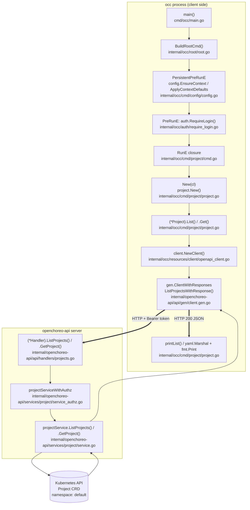
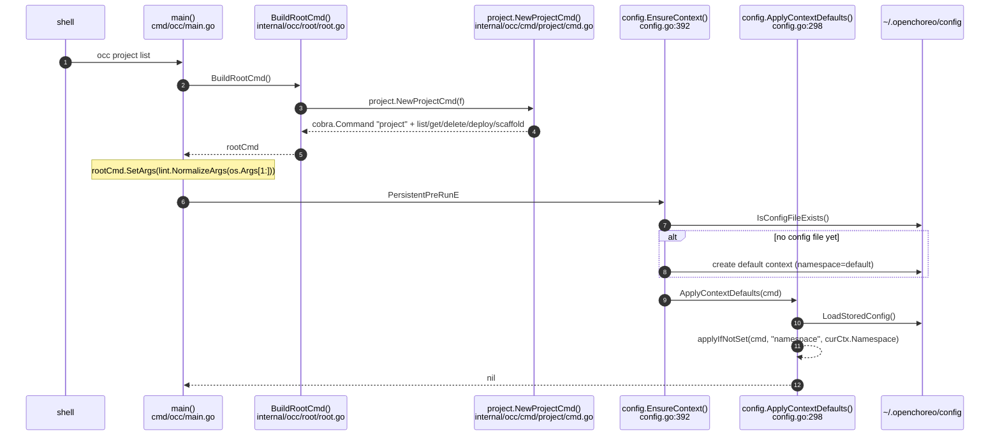
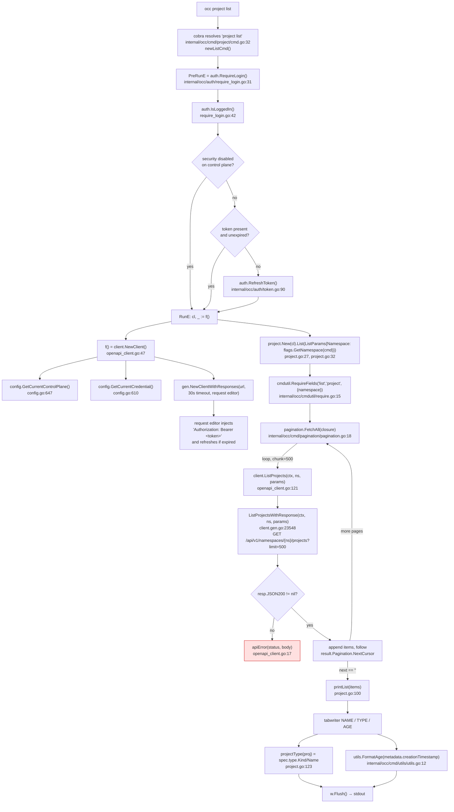
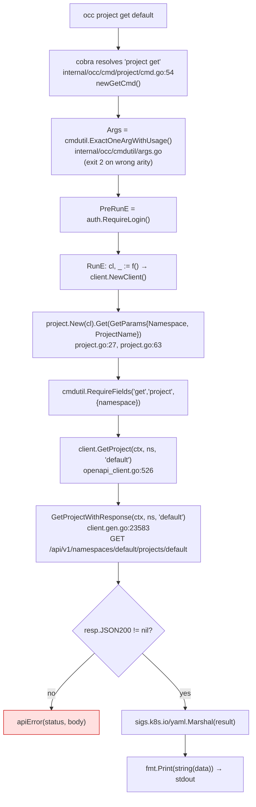
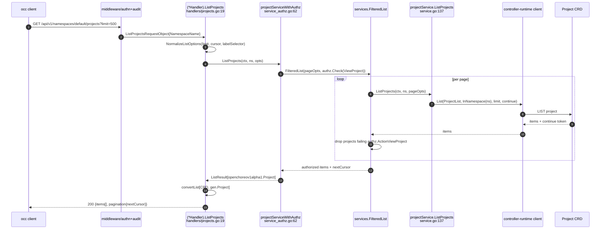
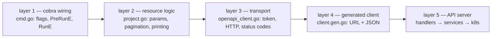

# `occ project list` / `occ project get` — End-to-End Call Flow

How `occ project list` and `occ project get default` travel from the binary to the
Kubernetes API and back to your terminal. Every box names the **function** and the
**file** that runs.

---

## 1. The whole path at a glance



---

## 2. Phase 1 — Process start and context bootstrap

`main()` in `cmd/occ/main.go:17` builds the command tree, then cobra walks it:



Key files:

| Function | File | Purpose |
|---|---|---|
| `main()` | `cmd/occ/main.go:17` | entrypoint, sets `PersistentPreRunE` |
| `BuildRootCmd()` | `internal/occ/root/root.go:56` | registers every subcommand on the root `occ` |
| `config.EnsureContext()` | `internal/occ/cmd/config/config.go:392` | creates `~/.openchoreo/config` + default context if absent |
| `config.ApplyContextDefaults()` | `internal/occ/cmd/config/config.go:298` | fills `--namespace` from the current context when the flag was not typed |
| `config.LoadStoredConfig()` | `internal/occ/cmd/config/storage.go:44` | reads and YAML-unmarshals `~/.openchoreo/config` |

This is why `occ project list` with no `--namespace` still queried `default`: the
namespace comes from the stored context, not from your command line.

---

## 3. Phase 2 — `occ project list`



Output shape:

```
NAME      TYPE                         AGE
default   ClusterProjectType/default   27d
```

- `AGE` comes from `utils.FormatAge()` — `s` / `m` / `h` / `d` buckets off
  `metadata.creationTimestamp`, hence `27d` from `2026-09-03T14:18:11Z`.
- `TYPE` is `spec.type.kind/spec.type.name`; when `kind` is nil `projectType()`
  substitutes `ProjectType` to match the API default.

---

## 4. Phase 3 — `occ project get default`



Difference from `list`: **no pagination loop** and **no `printList`** — the whole
`gen.Project` object is marshalled straight to YAML, which is why the output shows
the full `metadata`, `spec` and `status` blocks, including
`status.latestRelease.name: default-6d675ddbf6` and the `Created` / `Ready`
conditions the controller wrote.

---

## 5. Server side — what answers the HTTP call



For `get`, `projectServiceWithAuthz.GetProject()` (`service_authz.go:78`) does a
single `authz.Check(ViewProject)` instead of the per-page filter, then calls
`projectService.GetProject()` (`service.go:169`), which is a plain
`k8sClient.Get(ctx, ObjectKey{Name, Namespace}, project)`.

`audit/exemptions.go:117` marks `ListProjects` as `reasonRead`, which is why reads
are not written to the audit trail the way writes are.

---

## 6. Full call table

| # | Function | File | Role |
|---|---|---|---|
| 1 | `main()` | `cmd/occ/main.go:17` | builds root, installs `PersistentPreRunE`, handles exit codes |
| 2 | `BuildRootCmd()` | `internal/occ/root/root.go:56` | wires `project.NewProjectCmd(f)` and every other subcommand |
| 3 | `config.EnsureContext()` | `internal/occ/cmd/config/config.go:392` | default context bootstrap |
| 4 | `config.ApplyContextDefaults()` | `internal/occ/cmd/config/config.go:298` | `--namespace` default from stored context |
| 5 | `config.LoadStoredConfig()` | `internal/occ/cmd/config/storage.go:44` | reads `~/.openchoreo/config` |
| 6 | `project.NewProjectCmd()` | `internal/occ/cmd/project/cmd.go:15` | parent `project` command |
| 7 | `project.newListCmd()` | `internal/occ/cmd/project/cmd.go:32` | `occ project list` |
| 8 | `project.newGetCmd()` | `internal/occ/cmd/project/cmd.go:54` | `occ project get` |
| 9 | `auth.RequireLogin()` | `internal/occ/auth/require_login.go:31` | `PreRunE` login gate |
| 10 | `auth.IsLoggedIn()` | `internal/occ/auth/require_login.go:42` | security-disabled short-circuit, token check |
| 11 | `auth.RefreshToken()` | `internal/occ/auth/token.go:90` | renew an expired token |
| 12 | `flags.GetNamespace()` | `internal/occ/flags/flags.go:22` | read the `--namespace` flag |
| 13 | `project.New()` | `internal/occ/cmd/project/project.go:27` | wraps `client.Interface` into `*Project` |
| 14 | `(*Project).List()` | `internal/occ/cmd/project/project.go:32` | list orchestration + pagination |
| 15 | `(*Project).Get()` | `internal/occ/cmd/project/project.go:63` | single fetch + YAML print |
| 16 | `cmdutil.RequireFields()` | `internal/occ/cmdutil/require.go:15` | required-parameter guard |
| 17 | `cmdutil.ExactOneArgWithUsage()` | `internal/occ/cmdutil/args.go` | arity guard for `get` |
| 18 | `pagination.FetchAll()` | `internal/occ/cmd/pagination/pagination.go:18` | cursor loop, chunk 500 |
| 19 | `client.NewClient()` | `internal/occ/resources/client/openapi_client.go:47` | builds generated client, bearer token, 30s timeout |
| 20 | `apiError()` | `internal/occ/resources/client/openapi_client.go:17` | non-200 → readable error |
| 21 | `(*Client).ListProjects()` | `internal/occ/resources/client/openapi_client.go:121` | list wrapper |
| 22 | `(*Client).GetProject()` | `internal/occ/resources/client/openapi_client.go:526` | get wrapper |
| 23 | `ListProjectsWithResponse()` | `internal/openchoreo-api/api/gen/client.gen.go:23548` | builds/sends the HTTP request |
| 24 | `GetProjectWithResponse()` | `internal/openchoreo-api/api/gen/client.gen.go:23583` | builds/sends the HTTP request |
| 25 | `printList()` | `internal/occ/cmd/project/project.go:100` | tabwriter table |
| 26 | `projectType()` | `internal/occ/cmd/project/project.go:123` | `Kind/Name` column |
| 27 | `utils.FormatAge()` | `internal/occ/cmd/utils/utils.go:12` | `AGE` column |
| 28 | `(*Handler).ListProjects()` | `internal/openchoreo-api/api/handlers/projects.go:19` | server handler |
| 29 | `(*Handler).GetProject()` | `internal/openchoreo-api/api/handlers/projects.go:96` | server handler |
| 30 | `projectServiceWithAuthz.ListProjects()` | `internal/openchoreo-api/services/project/service_authz.go:62` | per-item `ActionViewProject` filter |
| 31 | `projectServiceWithAuthz.GetProject()` | `internal/openchoreo-api/services/project/service_authz.go:78` | single `ActionViewProject` check |
| 32 | `projectService.ListProjects()` | `internal/openchoreo-api/services/project/service.go:137` | controller-runtime `List` |
| 33 | `projectService.GetProject()` | `internal/openchoreo-api/services/project/service.go:169` | controller-runtime `Get` |

---

## 7. The three-layer rule

Every `occ` subcommand follows the same shape, so once you have read one you have
read all of them:



- **Layer 1** never touches HTTP; it only builds `Params` structs.
- **Layer 2** is per-resource and is where output formatting lives.
- **Layer 3** is shared by every resource — one place for auth and error mapping.
- **Layer 4** is generated from `openapi/`; do not hand-edit it.
- **Layer 5** is the server, and is a separate deployment from `occ` itself.

`occ lint` is the exception that proves the rule: it skips layers 3–5 entirely,
which is why `internal/occ/cmd/project/cmd.go` imports `client` but
`internal/occ/cmd/lint/` does not.